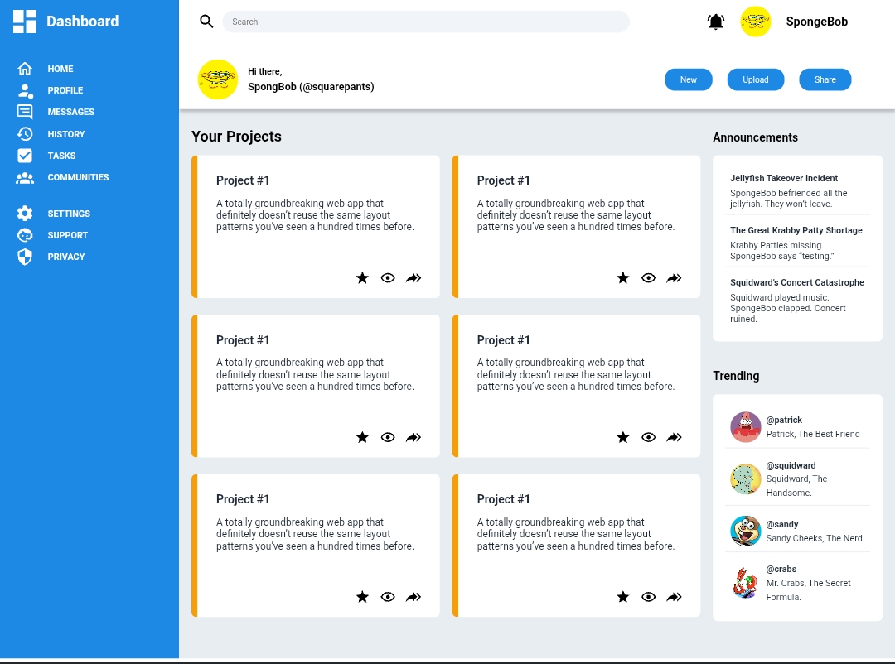

# Odin Admin Dashboard

A static admin dashboard UI built with pure HTML and CSS. Built to practice layout using CSS Grid and Flexbox, and positioning elements. Currently desktop-only.

## Screenshot

## Features

- Grid-based layout using CSS Grid and Flexbox
- Sidebar navigation with icon support
- Project cards with action icons
- Announcements and Trending sidebar panels
- Semantic CSS custom properties (variables) for easy theming

## Tech Stack

- HTML5
- CSS3 (Grid, Flexbox, Custom Properties)

## Known Limitations

- Not responsive — optimized for desktop viewports only
- No mobile or tablet breakpoints implemented
- No hover effects on interactive elements

## Credits

Project built as part of [The Odin Project](https://www.theodinproject.com/) curriculum.